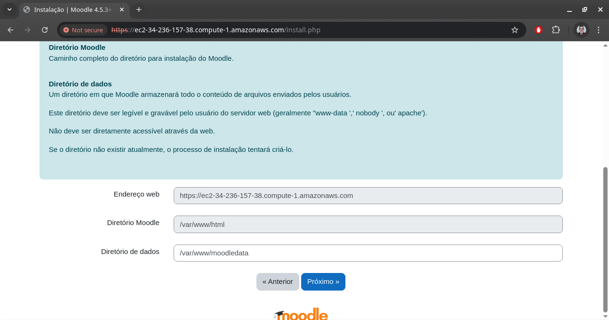
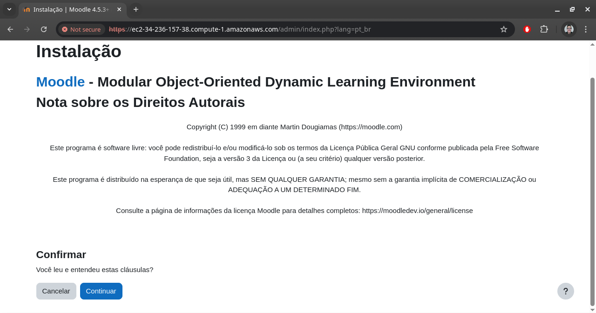
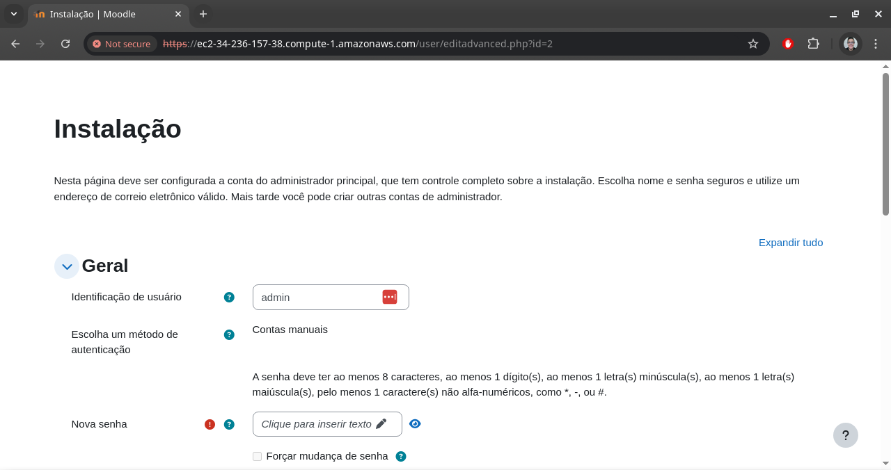
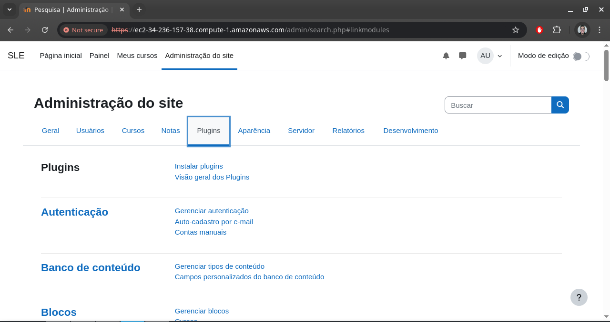
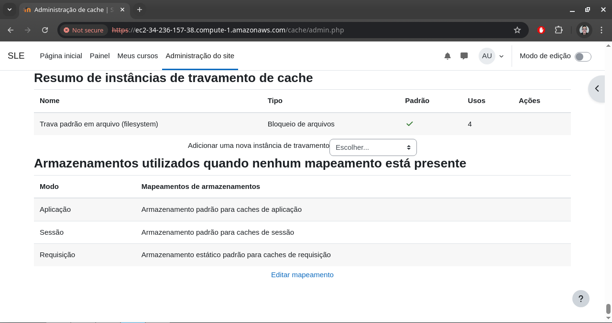
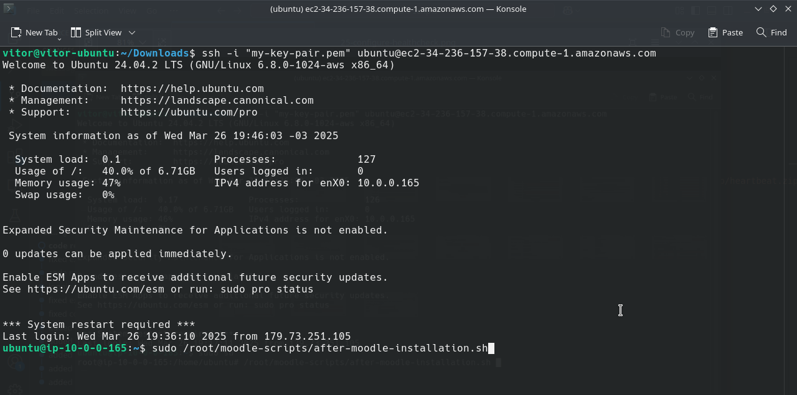
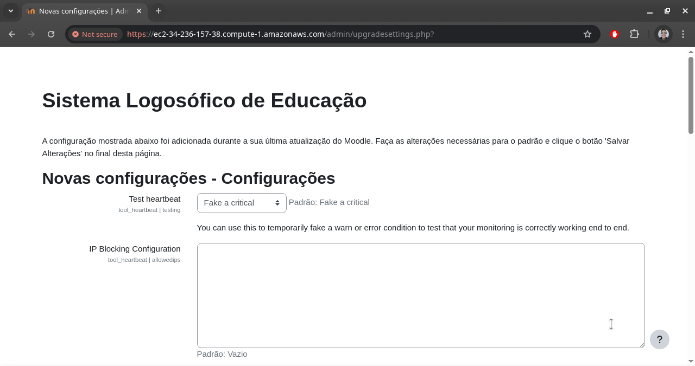
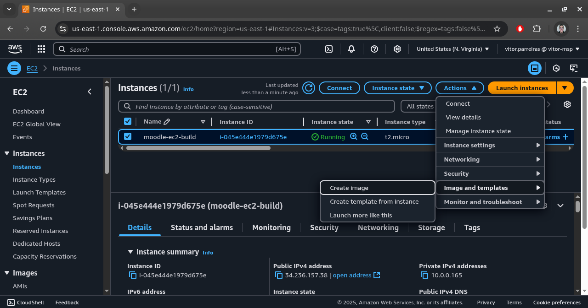
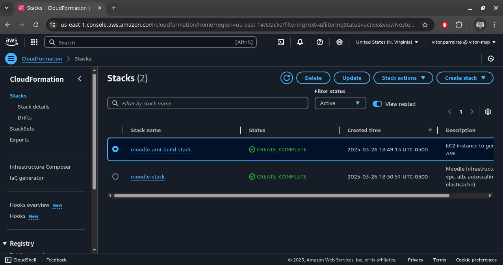
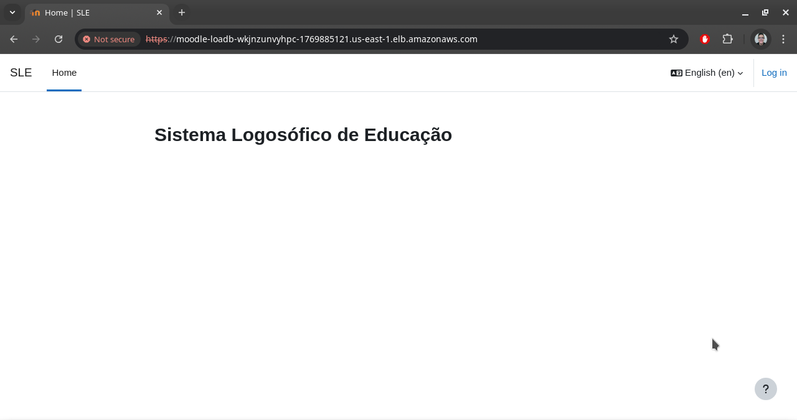

# Moodle AWS Infrastructure

### Infraestrutura como código do Moodle usando Amazon CloudFormation

Ver no [GitHub](https://github.com/vitor-msp/moodle-infra).

#### Importação de certificado TLS

1. Gere um certificado TLS e abra a console da AWS no AWS Certificate Manager.

2. Copie o conteúdo do certificado nos campos apropriados e salve.

3. Copie o ARN do certificado.

#### Criação da stack

4. Acesse o Amazon CloudFormation para criar uma nova stack.

5. Faça o upload do arquivo [moodle-infra-aws.yml](moodle-infra-aws.yml).

6. Preencha todos os parâmetros exigidos e apenas os vazios (sem valor default). Busque o AMI id do Ubuntu 24.04 LTS na região da AWS em que está e crie a stack. Pode levar até uns 20 minutos para finalizar a criação. Quando finalizar, os outputs estarão disponíveis, os quais serão usados em seguida.

7. Crie outra stack, desta vez utilizando o arquivo [generate-moodle-ami-aws.yml](generate-moodle-ami-aws.yml), preencha todos os parâmetros exigidos e novamente use o AMI id do Ubuntu 24.04 LTS na região da AWS em que está. A maioria dos parâmetros será algum output da stack anterior. Esta stack provavelmente finalizará em menos de 3 minutos.

8. Copie o output SSHCommand da stack anterior e execute o comando na pasta onde seu key pair está contido para acessar a máquina de configuração. Em seguida, execute o comando `tail -f /tmp/moodle-installation.log` e aguarde até que seja apresentada uma mensagem de instalação finalizada, como na imagem abaixo. Este processo pode levar até uns 20 minutos.

#### Configuração do Moodle

9. Acesse a URL do output EC2Url da stack anterior e prossiga mesmo com a notificação de conexão insegura. Esta mensagem é exibida pois o CA do certificado provavelmente não é reconhecido.

10. Selecione o idioma que preferir.

11. Prossiga sem alterações. O diretório de dados deve ser /var/www/moodledata.

12. Prossiga sem alterações. O driver deve ser PostgreSQL.

13. Preencha as informações de conexão com o banco de dados.

14. Leia as notas e confirme.

15. Nesta tela, todos os itens devem estar marcados com ok. Apenas siga em frente.

16. Preencha o que for obrigatório e o que achar necessário.

17. Preencha o que for obrigatório e o que achar necessário.

18.  Preencha um e-mail de suporte.

19. Se for direcionado à tela inicial do Moodle, sua instalação foi finalizada com sucesso.

#### Configuração do cache

20. Acesse "administração do site" -> "plugins".

21. Em "caching", acesse "configuração".

22. Logo no início da página, em "redis", acesse "adicionar instância".

23. Preencha as informações de acesso ao cache e salve. No campo "servidores" use o hostname e a porta separados por dois pontos, como na imagem. Marque o checkbox "use a criptografia tls". Você será direcionado a página anterior.

24. No final da página, na seção "armazenamentos utilizados quando nenhum mapeamento está presente", acesse "editar mapeamento".

25. Preencha "aplicação" e "sessão" com a instância de cache criada e salve. Isso finalizará a configuração do cache.

#### Configuração do healthcheck

26. Acesse por SSH a instância EC2 e execute o comando `sudo /root/moodle-scripts/after-moodle-installation.sh`.

27. Após finalização do script, accesse a URL do load balancer usando a rota */admin/settings.php?section=tool_heartbeat*. Todos os itens devem estar marcados com ok. Apenas siga em frente.

28. Clique em "verificar atualizações disponíveis". Se tiver alguma, siga as orientações na tela para realizar sua instalação.

29. Após checar as atualizações, siga em frente.

30. Confirme.

31. Preencha o que achar necessário.

32.  Para validar o processo, acesse a rota */admin/tool/heartbeat/*. Se for retornada a tela abaixo, a configuração do plugin Moodle Healthcheck foi finalizada com sucesso.

#### Geração do AMI

33.  Na console da AWS, acesse a instância criada e, em "ações", crie sua imagem.

34. Preencha os campos necessários e execute.

35. Após a imagem estar com status disponível, copie seu AMI id.

#### Atualização da stack

36. Volte no CloudFormation e delete a segunda stack (a que usa o arquivo [generate-moodle-ami-aws.yml](generate-moodle-ami-aws.yml)).

37. Em seguida, volta na primeira stack (a que usa o arquivo [moodle-infra-aws.yml](moodle-infra-aws.yml)) para atualizá-la.

38. Mantenha o template atual e prossiga.

39. Dos parâmetros exibidos, altere LaunchTemplateVersion para 2, MoodleAMIImageID para o AMI id gerado e NumberOfInstances para o número preferível de instâncias a serem executadas. Finalize o processo de atualização da stack.

#### Acesso ao Moodle

40. Acesse a URL do load balancer e prossiga mesmo com a notificação de conexão insegura.

41. Se for exibida a tela inicial do Moodle, o processo completo foi finalizado com sucesso. Para validar, acesse "login".

42. Preencha as credenciais da conta de administrador criada.

43. A tela inicial da conta será exibida.

#### Remoção de recursos

Para remover todos os recursos usados neste tutorial, além de remover as stacks, é necessário checar outros recursos que não são deletados junto com ela:
- RDS Snapshot: gerado na exclusão do RDS
- CloudWatch Log Groups: logs do Nginx
- AMI: imagens geradas
- EBS Snapshot: gerados para uso do AMI
- Certificado: criado no início do tutorial
- S3: arquivos de upload do CloudFormation

---

fim